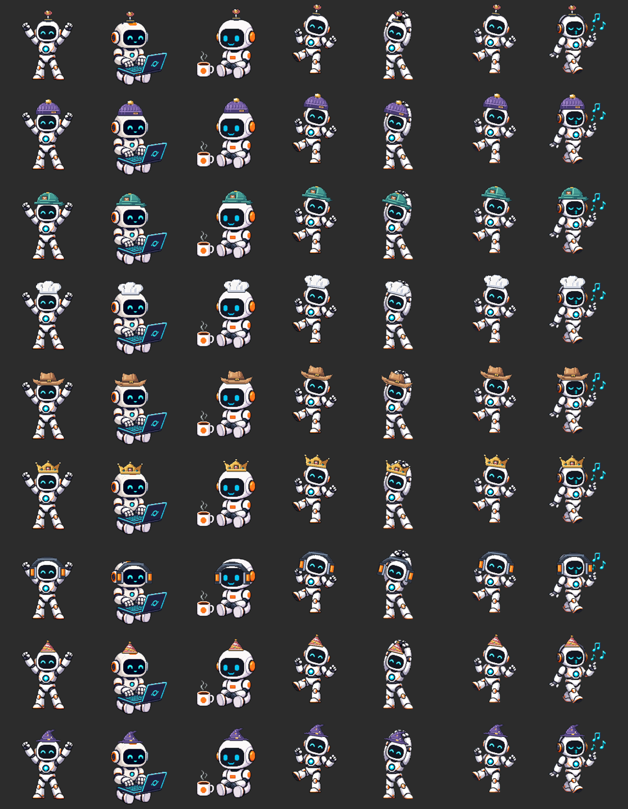

# Headwear and the built-in antenna

2026-09-19. Local change, not uploaded.

Every valid head-slot item suppresses the robot's built-in antenna. The antenna accessory supplies its own artwork instead of stacking on top of the original. Removing headwear restores the untouched original frame. Unknown items do not suppress the antenna.

Authored antenna bounds cover every motion family and the three fixed poses. Removal occurs before recoloring and is cached separately. Animated views, fixed poses and widget compositions use the same rule. Product previews inherit it through their draft outfit. Source PNGs are unchanged.

Validation includes all frame families, face and helmet preservation, all head items, invalid selections and cached restoration. The contact sheet has columns h01, t01, c01, e01, pose2, pose3, pose4; rows antenna, beanie, cap, chef-hat, cowboy-hat, crown, headphones, party-hat, wizard-hat. These are offline composition proofs.

2,474 wardrobe checks passed. Release Simulator app and widget build passed without warnings. Live headwear toggling and physical-device behavior were not re-tested in this pass.
