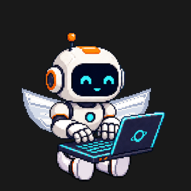

# Wing motion

2026-09-19. Local implementation, not uploaded.

The live mascot splits the wing sprite at its authored back pivot. Each half folds and rotates around the same shoulder attachment in opposite directions. Two gentle beats last 1.8 seconds, followed by 5.4 seconds without wing animations. Frame changes retain the running wing animation. Removing wings, disabling motion, leaving the screen or detaching the view cancels the scheduled work and clears both animations. Widgets and static poses retain their still artwork.

Validation: 270 mascot checks, 694 companion checks and 2,271 wardrobe checks passed. Release Simulator app and widget build passed without warnings. The application was installed and launched in the dedicated test simulator, and the visible placement was inspected. Reduce Motion and background cancellation were checked in the shared lifecycle path, but not exercised through native UI automation. No physical-device battery measurement was performed.

The preview below is an offline composition using the production curve, pivot and split, with the typing rest frame held still to show the wing motion clearly.

