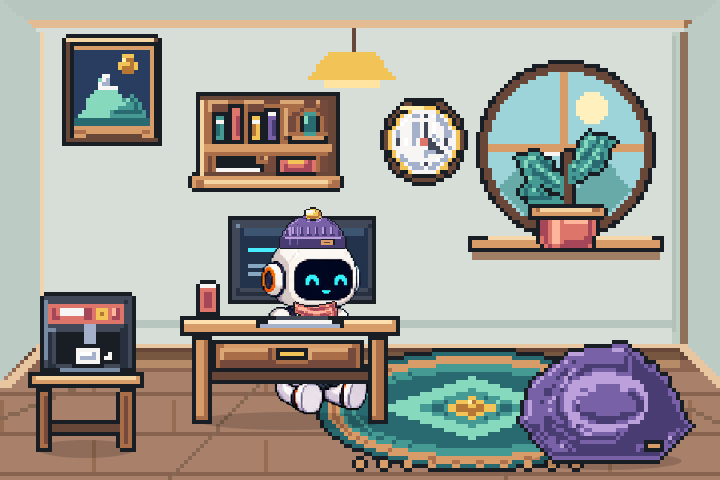
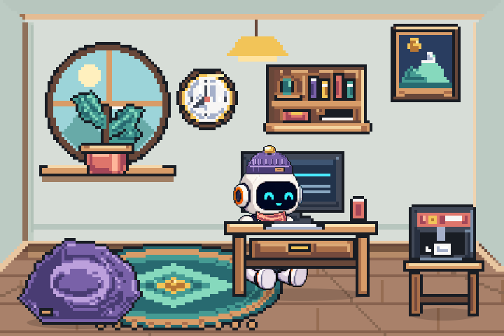

# Working pose correction

2026-09-19. Local change, not uploaded to TestFlight.

Typing anchors previously moved the equipped hand item between two positions and hid it on only some frames. Drinking frames also toggled the item while the original cup was already part of the drawing. Hand items now stay hidden throughout typing and drinking, with ownership and selection preserved. The shared placement path covers animation, static cards and widget composites. Outfit try-on uses the idle pose so an item remains visible during a running session.

The working source frames contain a torso and laptop without a lower body. The shared frame cache now composes the existing seated lower body behind the laptop before applying the selected colorway. Both boots stay stationary through all typing frames, and the shadow anchor follows the completed silhouette. This composition is cached, not rebuilt on animation ticks. In the room, the seated lower body is positioned beneath the desk drawer while the upper pose retains its desktop clipping.

Validation:

- Reproduced the occupied-hand regression before the fix.
- All 29 iPhone and 13 Mac README check groups passed.
- 2,269 wardrobe checks passed, including every typing frame, every hand item, return to idle, stable boot pixels, production frame cache and room placement in both layouts.
- Wardrobe art contract passed.
- Release Simulator application and widget build passed.
- Application installed and launched in the dedicated test simulator. Today shows the complete working pose.
- Room proofs cover three rooms, four activities and both layouts. Attached images use the production compositor and placement geometry; they are not device screenshots.
- Native UI automation timed out, so interactive shop navigation and an actual-device performance test remain unverified.

## Facing correction

The first lower-body composition incorrectly retained the left-facing coffee pose under the right-facing typing torso. The crop is now reflected horizontally before both the working-frame composition and room placement. This keeps the knees and toes oriented toward the laptop, without flipping the torso, laptop or outfit.

A regression check against the authored source failed before the change and passes after it. All typing frames retain two stable boot samples at their corrected positions. The attached images have been replaced with the corrected renders.
